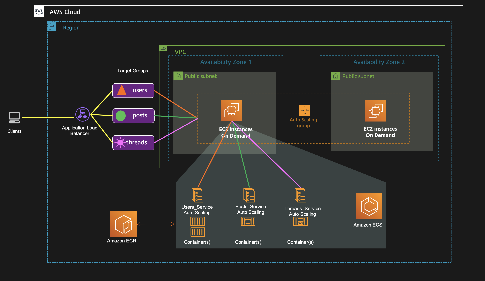
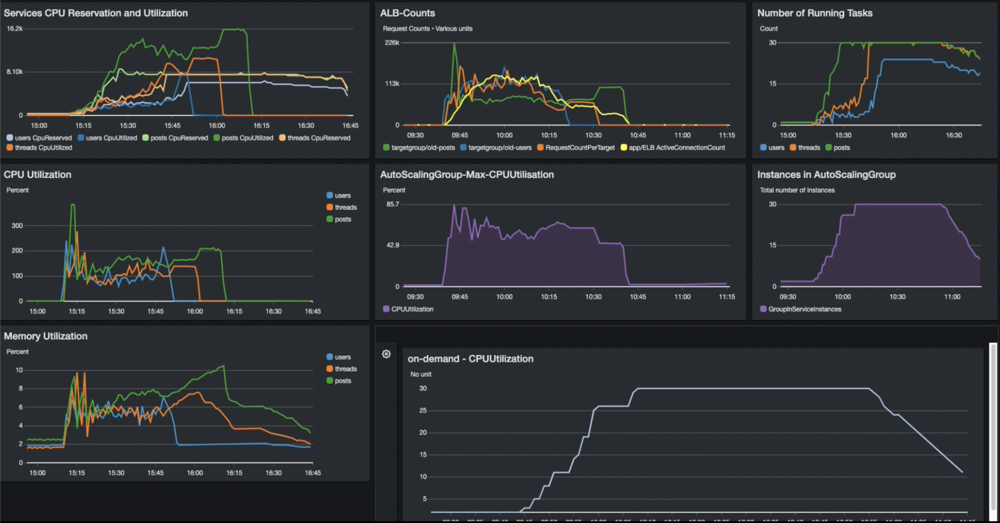

## ECS Microservices application on AutoScaling Group

For the OLD Microservices application, we will henceforth call this OLD_Microservices.

In this sample, we will implement some of the strategies discussed here into a Microservices Nodejs sample application. Lets call it Old (pre-applying some of these strategies) and New(after implementing strategies).

Reference link : 

In this example the microservices application is deployed on ECS.




## Application Microsevices

The sample has 3 services defined behind an Amazon Application Load Balancer (ALB), and we create rules on the ALB that direct requests that match a specific path to a specific service.

```
/api/users/* -> A service for all user related REST paths
/api/posts/* -> A service for all post related REST paths
/api/threads/* -> A service for all thread related REST paths
```

So each service will only serve one particular class of REST object, and nothing else. This will give us some significant advantages in our ability to independently monitor and independently scale each service.


## Prerequisites
You will need to have the latest version of the AWS CLI installed and configured before running the deployment script. 
If you need help installing, please follow the link below:

[Installing the AWS CLI ](https://)


## Deployment for OLD_Microservices
Replace items written in <> with actual values

1. Launch an ECS cluster using the Cloudformation template:

   ```
   $ aws cloudformation deploy \
   --template-file infrastructure/ecs.yml \
   --region <region> \
   --stack-name <stack name> \
   --capabilities CAPABILITY_NAMED_IAM \
   --tags Purpose=CostStrategiesDemo Project=OldMicroservices
   ```

2. Deploy the services onto your cluster: 

   ```
   $ ./infrastructure/deploy.sh <region> <stack name>
   ```
   
3. Deploy the CloudWatch dashboard:
   ```
   $ ./infrastructure/deploy-cw-dashboard.sh <region> <stack name>
   ```

Load test this with your favourite load testing application. 
You could also use, [Distributed Load Testing on AWS Solution](https://aws.amazon.com/solutions/implementations/distributed-load-testing-on-aws/) from AWS Solutions Library.

In my load test, I could see below 


## Load test Compute cost estimate

Region : US-WEST-1
30 m4.large instances – On Demand. Consider constant use for a month.
30 instances x 0.117 USD On Demand hourly cost x 730 hrs in a month 
= 2562.00 USD

Total cost (monthly): 2562.00 USD

Reference -> [AWS Pricing Calculator](https://calculator.aws/#/)


